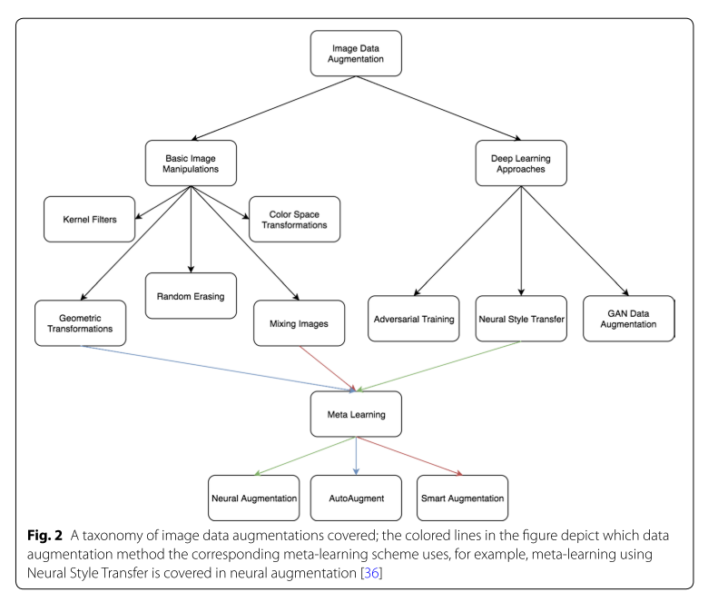

# A survey on Image Data Augmentation for Deep Learning

Connor Shorten	Taghi M. Khoshgoftaar

## Contribution

Presents a series of Data Augmentation solutions to the problem of overfitting in Deep Learning models due to limited data.

## Image Data Augmentation techniques

### Data Augmentation based on basic image manipulations

- Geometric transformations
  - Flipping
  - Color space
  - Cropping
  - Rotation
  - Translation
  - Noise injection

- Color space transformations

- Kernel filter

- Mixing images
  - SamplePairing
  - Non-linearly mixing images
  - Mixing through random image cropping and patching

- Random erasing

#### A note on combining augmentations

Combining augmentations can result in inflated dataset sizes. However, in domains with very limited data, this may cause further overfitting. Therefore, it is important to consider search algorithm for deriving an ooptimal subset of augmented data.

### Data Augmentation based on Deep Learning

- Feature space augmentation

- Adverarial training

- GAN-based Data Augmentation

- Neural Style Transfer

- Meta learning Data Augmentations
   - Neural augmentation
   - Smart augmentation
   - AutoAugment

#### Comparing Augmentations

Cropping, flipping, WGAN, and rotation gernerally performed better than others.

Combinations of flipping + cropping and flipping + WGAN were the best overall.

## Design considerations for image Data Augmentation

- Test-time augmentation
  - costly but robust, perhaps can be used in medical image diagnosis.

- Curriculum learning
  - initially train with original data only

- Resolution impact
  - tradeoff between accuracy and speed
  - high resolution GAN 

- Final dataset size
  - storing problems
- Alleviating class imbalance with Data Augmentation
  - class imbalance may lead to overfitting